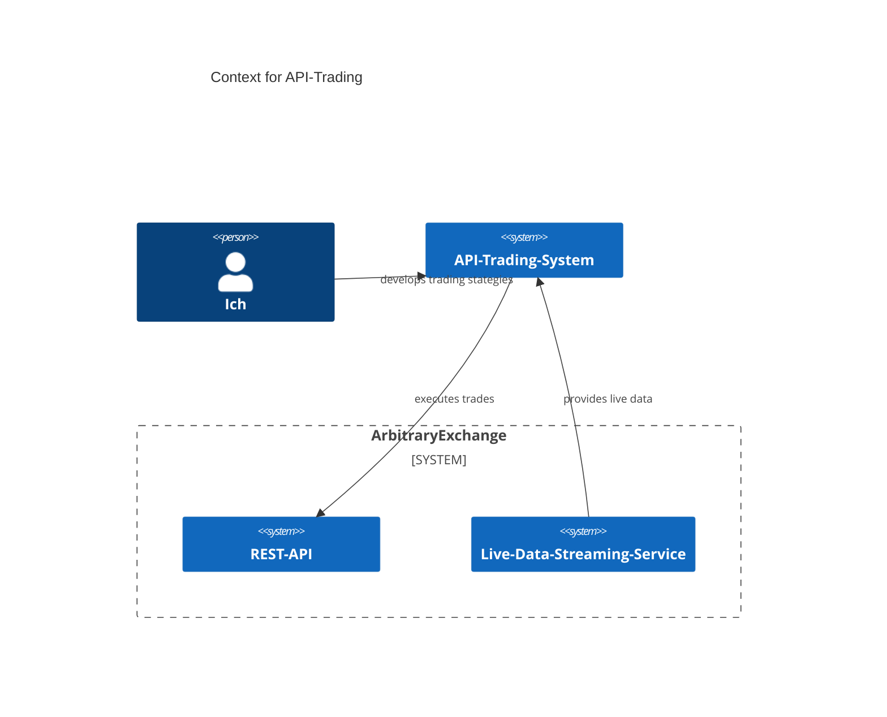
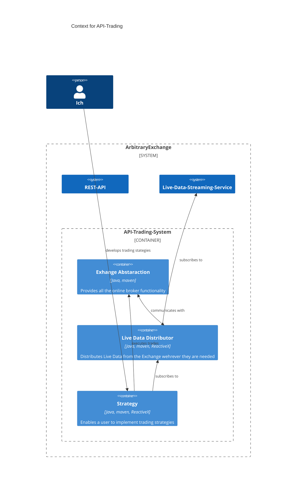
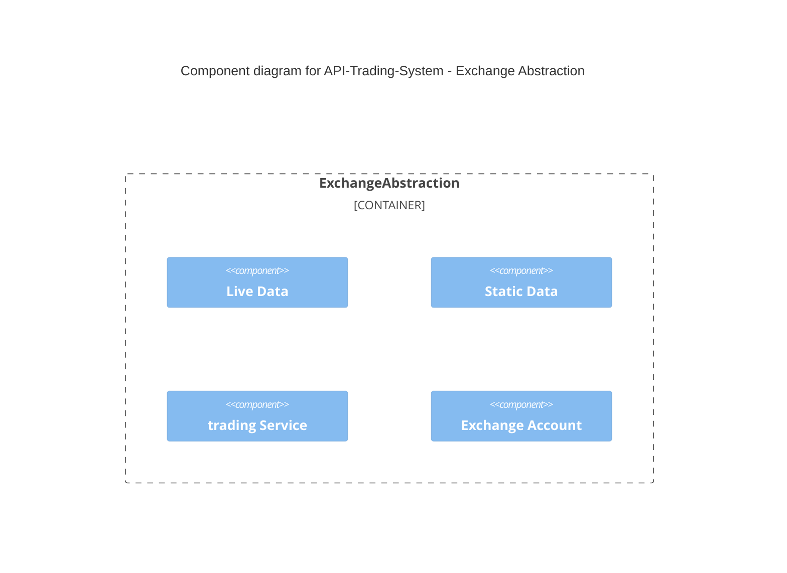

# API-Trading Architecture

```mermaid
C4Context
title Context for API-Trading
Person(ich, "Ich")

System(apitradingsystem, "API-Trading-System")

System_Boundary(eb, "ArbitraryExchange"){
    System(restapi, "REST-API")
    System(liveapi, "Live-Data-Streaming-Service")
}

Rel(ich, apitradingsystem, "develops trading stategies")
Rel(apitradingsystem, restapi, "executes trades")
Rel(liveapi, apitradingsystem, "provides live data")
```

```mermaid
C4Container
title Container diagram for API-Trading

title Context for API-Trading
Person(ich, "Ich")

System_Boundary(eb, "ArbitraryExchange"){
    System(restapi, "REST-API")
    System(liveapi, "Live-Data-Streaming-Service")

Container_Boundary(apitradingsystem, "API-Trading-System") {
        Container(ea, "Exhange Abstaraction", "Java, maven", "Provides all the online broker functionality")
        Container(ldd, "Live Data Distributor", "Java, maven, ReactiveX", "Distributes Live Data from the Exchange wehrever they are needed")
        Container(strat, "Strategy", "Java, maven, ReactiveX", "Enables a user to implement trading strategies")
    }

}

Rel(ich, strat, "develops trading stategies")
Rel(strat, ea, "executes trades")
Rel(ldd, liveapi, "subscribes to")
Rel(strat, ldd, "subscribes to")
BiRel(ea, ldd, "communicates with")
```

```mermaid
C4Component
title Component diagram for API-Trading-System - Exchange Abstraction

Container_Boundary(ea, "ExchangeAbstraction"){
    Component(ld, "Live Data")
    Component(sd, "Static Data")
    Component(ts, "trading Service")
    Component(eacc, "Exchange Account")
}

```
